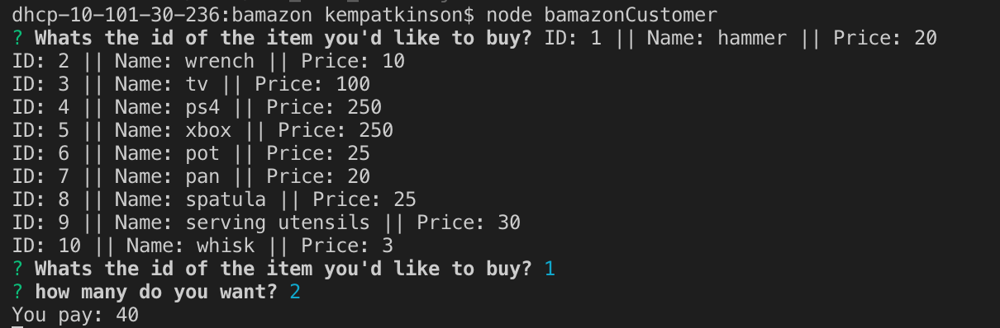
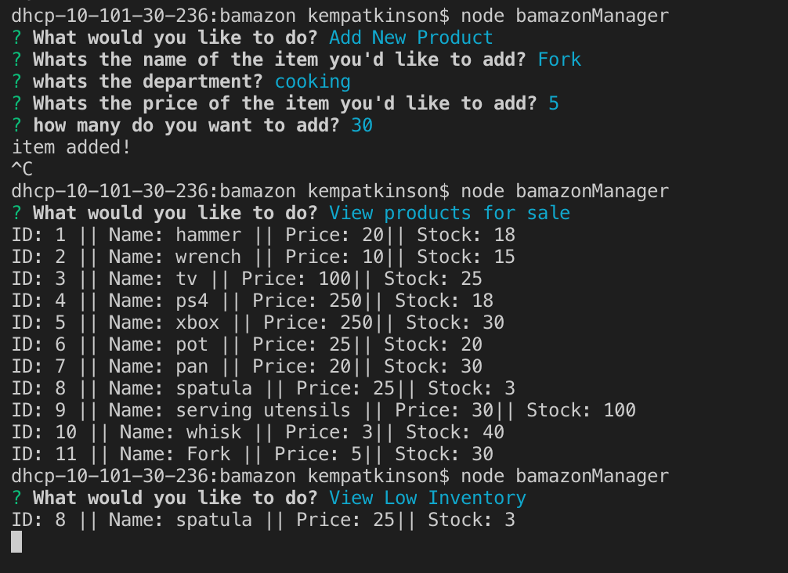
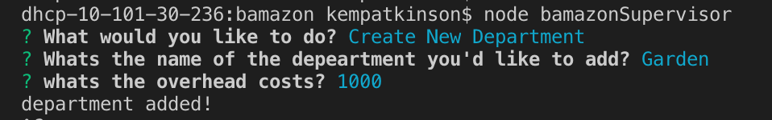

This is an app that runs inquirer with three different levels. 

CUSTOMER

In the folder, after running "node bamazonCustomer.js", a table of all products are displayed.

The app then prompt users with two messages:
The first asks them the ID of the product they would like to buy.
The second message asks how many units of the product they would like to buy.

Once the customer has placed the order, the application checks if the store has enough of the product to meet the customer's request. If not, the app logs `Insufficient quantity!`, and then prevent the order from going through.
However, if the store _does_ have enough of the product, it fulfills the customer's order.This means updating the SQL database to reflect the remaining quantity. Once the update goes through, show the customer the total cost of their purchase.
Customer

MANAGER

Running `node bamazonManager.js` will:

  * List a set of menu options:

    * View Products for Sale
      If a manager selects `View Products for Sale`, the app lists every available item: the item IDs, names, prices, and quantities.
    
    * View Low Inventory
     If a manager selects `View Low Inventory`, then it lists all items with an inventory count lower than five.

    
    * Add to Inventory
     If a manager selects `Add to Inventory`, your app displays a prompt that will let the manager "add more" of any item currently in the store.
    
    * Add New Product
    If a manager selects `Add New Product`, it allows the manager to add a completely new product to the store.

SUPERVISOR  (this table is a little unfunctional)

 Running "node bamazonSupervisor.js" will list a set of menu options:

   * View Product Sales by Department
   When a supervisor selects `View Product Sales by Department`, the app should display a summarized table in their terminal/bash window. This table contains the department id's, department names, overhead costs, product sales, and total profits (the difference between overhead costs and product sales).
   
   * Create New Department
  This simply allows the manager to create a new department.

